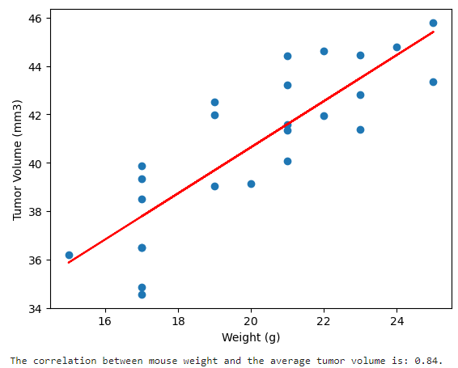

**PYMACEUTICALS CHALLENGE**

**(1) Project Overview and Purpose:**

Using a complete data from the most recent animal study at Pymaceuticals, Inc., a comparison of their novel therapy, Capomulin, is needed against the other treatment regimens. Geneneration of all of the tables and figures (TFLs) needed for the technical report of the clinical study is needed as well as a top-level summary of the study results.

**(2) Dataset Description:**

Two .csv datasets are being used for generating the TFLs and the summary, which are stored in the **data** folder:

(a) Mouse_metadata.csv contains information at the subject (mouse) level and includes Mouse ID; Drug Regimen; Age; and Weight

(b) Study_results.csv contains additional information at the subject(mouse) level and included testing timepoint and tumor information (volume and metastases)

**(3) Data Cleaning and Preprocessing:**

A determination was made about any duplicate information that might be present in the data. Duplicate data for Mouse g989 was dropped before any analyses began.

**(4) Data Visualization Techniques:**

The following were generated and will be described further below-

(a) Summary statistics

(b) Bar charts

(c) Pie charts

(d) Box and Whisker plots

(e) Line plot

(f) Scatter plots

**(5) Results and Analysis:**

(a) Summary Statistics by Drug Regimen-

(b) Total number of Observed Mouse Timepoints for each Drug Regimen-

(c) Distribution of female versus male mice-

(d) Final Tumor Volume versus Drug Regimen-

(e) Tumor Volume versus Timepoint on Capomulin [Mouse r554]-

(f) Tumor Volume versus Weight for Capomulin-

(g) Linear Regression model and Correlation Coefficient-

Overall, Capomulin has promising results, with Ramicane falling short of Capomulin results but ahead of other drug products for which data was supplied. More data would be helpful at elucidating some of these early high level summary points:

Capomulin and Ramicane have more oberserved timepoints than other treatments. Exploring whether this relates to mice being able to tolerate these treatments better and thus, more time on regimen and/or any early in treatment mortality data by regimen could guide next steps in drug development

Capomulin and Ramicane have lower final tumor volumes as compared to at least two other regimens, which could be indicative of partial response to drug. Further data could drive finalization of critical drug decisions, such as duration of treatment; optimal dose; formulation; etc.

The correlation between mouse weight and the average tumor volume in the Capomulin group is fairly strong, but exploring other factors, like gender or any genetic variables, would provide more insight for Capomulin treatment.

**(6) Ethical Considerations:**

(Discuss any ethical considerations taken into account during the project, such as data privacy, bias, or fairness)

**(7) Instructions for Interacting with the Project:**

(Provide clear instructions on how to interact with the visualizations, such as how to run the code or access the visualizations)

**(8) Citations:**

(a) pandas.DataFrame.drop_duplicates. (2024). Retrieved from https://pandas.pydata.org/docs/reference/api/pandas.DataFrame.drop_duplicates.html/

(b) Saturn Cloud. (2023, July 10). How to Drop Pandas DataFrame Rows Based on a Condition: A Guide. Retrieved from https://saturncloud.io/blog/how-to-drop-pandas-dataframe-rows-based-on-a-condition-a-comprehensive-guide/

(c) Ciccarello, N. (2021, September 25). Grouped Summary Statistics. Retrieved from: https://www.nickylovesdata.com/blog/grouped-summary-statistics/

(d) pandas.DataFrame.sort_values. (2024). Retrieved from https://pandas.pydata.org/docs/reference/api/pandas.DataFrame.sort_values.html/

(e) How to change outlier point symbol in Python matplotlib.pyplot. (2021, February). Stack Overflow. Retrieved from https://stackoverflow.com/questions/65648502/how-to-change-outlier-point-symbol-in-python-matplotlib-pyplot/

(f) Outside class group discussion, 30-Apr-2024

(g) Tutoring session, 01-May-2024

(h) Various questions to Xpert Learning Assistant for Scatterplotting and Box and Whisker plotting

